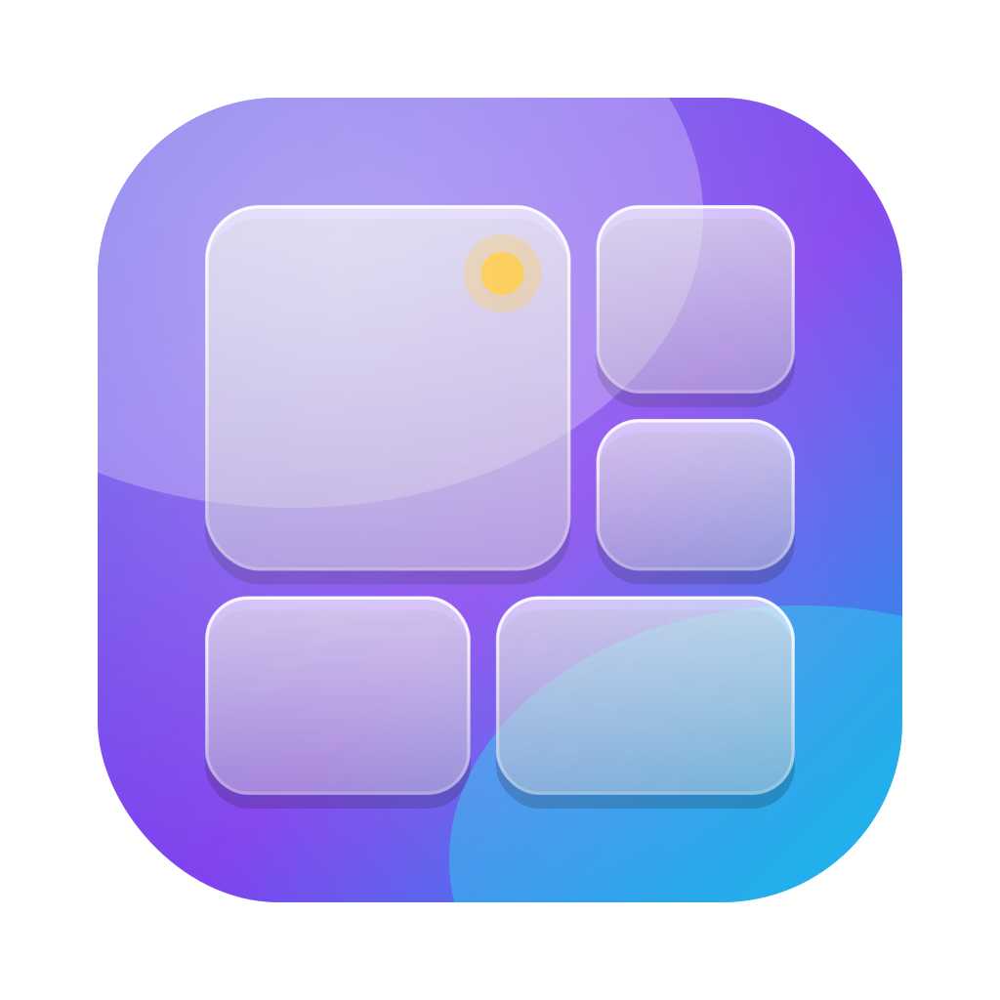
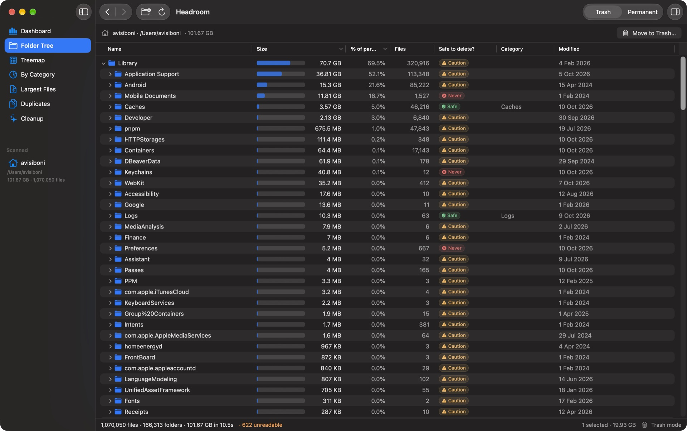
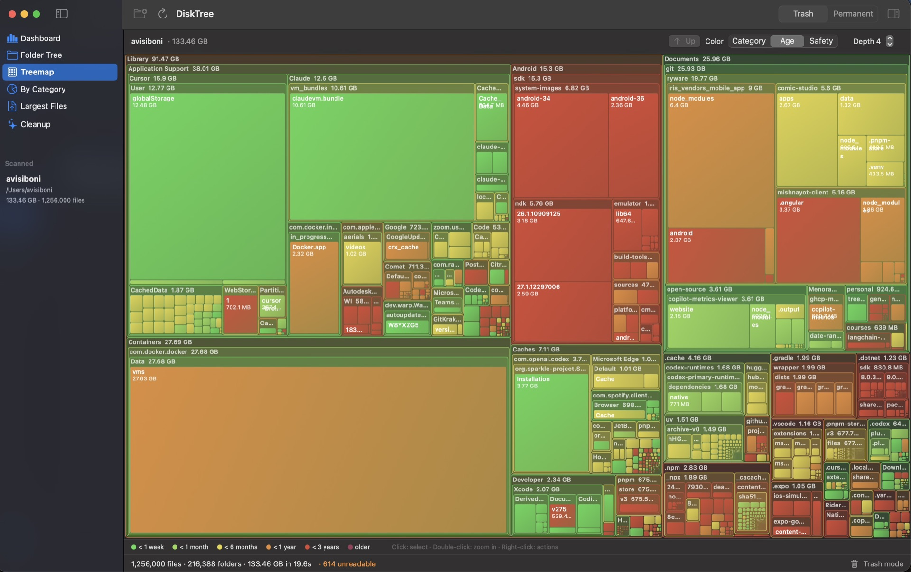
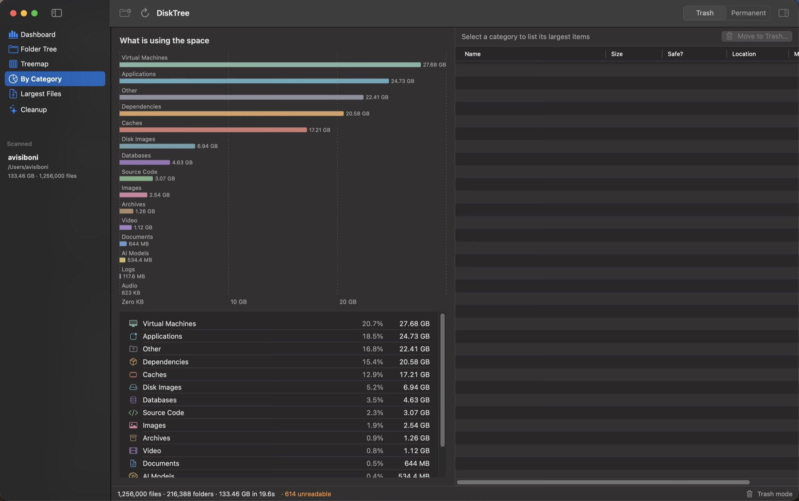
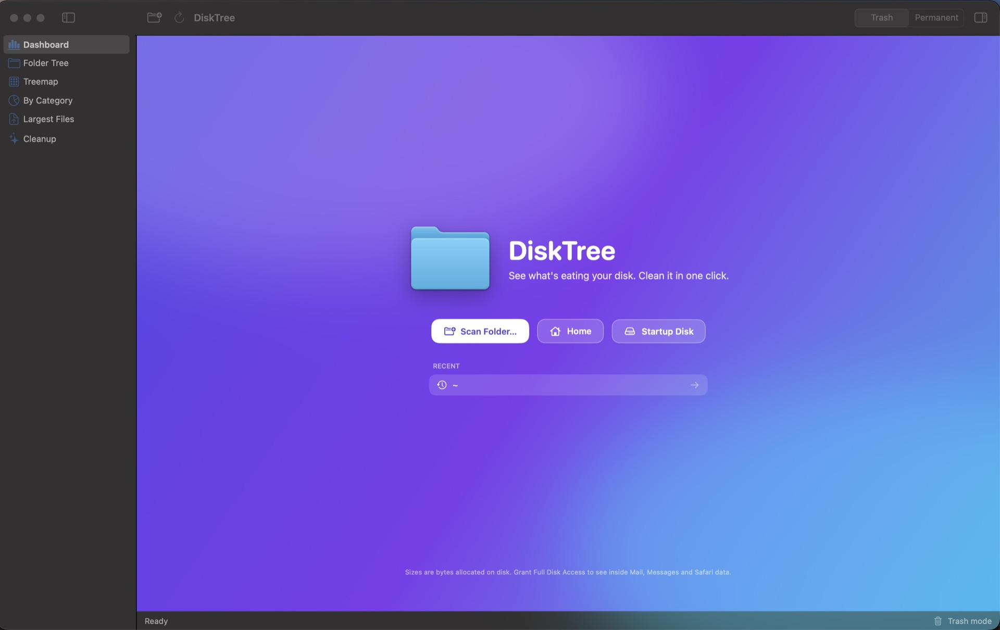

# DiskTree

<p align="center">
  
</p>

<h3 align="center">See what is eating your Mac's disk. Reclaim the space safely.</h3>

<p align="center">
  A fast, native macOS disk space analyzer, storage visualizer, and cleanup utility.<br>
  <strong>Completely free. No subscription, ads, tracking, accounts, or in-app purchases.</strong>
</p>

<p align="center">
  <a href="https://github.com/Ryware/DiskTree/actions/workflows/build.yml"></a>
  <a href="https://github.com/Ryware/DiskTree/actions/workflows/build.yml"></a>
  <a href="https://github.com/Ryware/DiskTree/actions/workflows/build.yml"></a>
  <br>
  <a href="https://github.com/Ryware/DiskTree/releases/latest"></a>
  <a href="https://github.com/Ryware/DiskTree/releases"></a>
  
  
  
  <br>
  
  
  
  <a href="LICENSE"></a>
  <a href="https://github.com/Ryware/DiskTree/stargazers"></a>
</p>

<p align="center">
  <a href="../../releases/latest"><strong>Download the latest release</strong></a>
  ·
  <a href="#build-from-source">Build from source</a>
  ·
  <a href="#safety-and-privacy">Safety & privacy</a>
</p>


DiskTree turns a crowded drive into an understandable map. Scan a folder or disk, identify the largest files and developer caches, inspect what is safe to remove, and clean up without leaving the app.

## Why DiskTree

- **Find space fast** — a native scanner uses macOS `getattrlistbulk(2)` and parallel directory traversal.
- **Understand it visually** — explore a detailed folder tree, a squarified treemap, file categories, and the largest individual files and bundles.
- **Delete with context** — safety badges explain what an item is, whether it is usually safe to remove, and what deletion may affect.
- **Clean developer clutter** — discover caches, DerivedData, `node_modules`, package stores, build output, logs, virtual machines, and other regenerable data.
- **Watch it from the menu bar** — a live free-space ring, 7-day trend, low-space and sudden-drop alerts, and one-click cleanup of safe caches.
- **Stay in control** — choose recoverable Trash mode or an explicit permanent-delete mode.
- **Keep data private** — analysis happens locally on your Mac; DiskTree does not require an account or send scan data anywhere.

## Screenshots

### Explore every folder without losing context



The virtualized folder tree stays responsive with very large directories. Sort by size, share of parent, file count, safety, category, or modification date.

### See the whole drive at a glance



The interactive treemap can be colored by category, age, or deletion safety. Double-click to zoom and right-click an item for actions.

### Understand what consumes the space



Categories separate applications, dependencies, caches, disk images, virtual machines, media, archives, source code, documents, and more.

<details>
<summary><strong>Welcome screen</strong></summary>



</details>

## Features

### Dashboard

A clear overview of the scanned location with:

- live volume free, used, and total space;
- allocated and logical size;
- file and folder counts;
- cleanup candidate totals;
- category usage; and
- links to the five largest files and apps.

### Folder Tree

A virtualized `NSOutlineView` creates only the visible rows and recycles cells, so even enormous dependency folders remain practical to explore. Sizes show bytes allocated on disk, with inline share-of-parent bars and sortable columns.

### Treemap

A nested, squarified storage map inspired by tools such as WizTree and SpaceSniffer. Choose the nesting depth and color by category, file age, or safety verdict. Hover for details, double-click to zoom, and right-click to act.

### Categories and Largest Files

Review storage by file type or browse the 100 largest files and bundles. A size threshold makes it easy to focus on items that can meaningfully free space.

### Cleanup

DiskTree finds regenerable junk inside the selected folder and in known home-folder locations, including:

- Xcode DerivedData and build output;
- npm, pnpm, pip, Gradle, NuGet, and Cargo caches;
- `node_modules`, `.build`, `.venv`, `target`, `dist`, and `__pycache__`;
- application caches and logs; and
- Trash contents.

Nothing is removed merely because it was found. You review and select cleanup candidates first.

### Menu bar monitor

DiskTree can live in the menu bar and keep an eye on your startup disk while you work.

- **Free-space ring** in the menu bar: the arc is the share of the disk that is free, turning amber and then red as space runs low. Optionally show the free space as text.
- **Popover** on click: free / used / total, a Healthy / Getting low / Low status, and a 7-day free-space chart.
- **Reclaimable now**: totals the safe caches, logs and build output DiskTree found, and cleans only those Safe items to the Trash with one click.
- **Alerts** as local notifications when free space drops below a threshold (default 10 GB) or falls quickly (default 5 GB within an hour). Tap an alert to open DiskTree.
- **Shortcuts**: Open DiskTree, Scan Home, Settings, Quit.

Settings (**DiskTree → Settings…**, ⌘,):

| Setting | Default | What it does |
| --- | --- | --- |
| Show DiskTree in the menu bar | On | Adds or removes the ring. |
| Show free space next to the icon | Off | Adds text such as "42 GB" beside the ring. |
| Keep running when the window is closed | On | Closing the window leaves the monitor running. Quit from the popover. |
| Show in the Dock | On | Turn off for a menu-bar-only app. |
| Open at login | Off | Starts DiskTree quietly in the menu bar. |
| Warn when free space is low | On, below 10 GB | Local notification, at most once every 6 hours. |
| Warn when space drops quickly | On, 5 GB in an hour | Local notification, at most once every 3 hours. |
| Deleting | Trash | Trash (recoverable) or permanent (instant, no undo). |

History is stored only on your Mac in `~/Library/Application Support/DiskTree/`, and nothing is uploaded. The Mac App Store build omits the known-locations cleanup because of the sandbox.

### Safety Inspector

A rule base covering roughly 150 macOS and developer-tool locations gives each recognized item a consistent safety verdict and plain-language explanation. Unknown or sensitive items remain clearly marked for manual review.

## Safety and privacy

DiskTree works locally and has no account system, analytics SDK, or cloud service.

Deletion is always user-initiated:

- **Trash** uses `FileManager.trashItem` and is recoverable until Trash is emptied.
- **Permanent** uses a fast parallel removal engine and cannot be undone.

For the safest workflow, leave DiskTree in Trash mode and review safety details before deleting anything. Important files should always have a backup.

### Full Disk Access

macOS protects locations such as Mail, Messages, and Safari data. If you want DiskTree to inspect those folders, grant Full Disk Access in **System Settings → Privacy & Security → Full Disk Access**. DiskTree reports unreadable folders in the status bar when access is unavailable.

## Performance

APFS does not expose an equivalent to Windows' NTFS Master File Table. DiskTree therefore uses `getattrlistbulk(2)`, which returns batches of directory entries with names, types, modification dates, and allocated sizes in one system call. The scanner decodes those batches directly and distributes directory work across Swift's cooperative task pool.

Permanent deletion follows a parallel POSIX strategy:

1. selected roots are atomically renamed to hidden siblings so they disappear from the interface immediately;
2. directories use their own `dirfd` and remove entries with `unlinkat`, avoiding repeated full-path walks; and
3. empty directories are removed deepest-first, with each level processed in parallel.

Trash mode uses the standard macOS Trash API instead.

## Requirements

- macOS 14 Sonoma or newer
- Apple silicon or Intel Mac
- Full Disk Access only when scanning protected system or user-data locations

## Install

1. Open the [latest release](../../releases/latest).
2. Download `DiskTree-<version>.dmg`.
3. Drag **DiskTree** to **Applications**.
4. Open DiskTree and choose a folder, your home directory, or the startup disk.

A notarized release should open normally through Gatekeeper. If you build locally, the ad-hoc signed development build is placed in `build/DiskTree.app`.

## Build from source

Requires Xcode 15 or newer.

```sh
./build.sh      # build/DiskTree.app
./build.sh run  # build and open
```

To generate an Xcode project:

```sh
brew install xcodegen
xcodegen
open DiskTree.xcodeproj
```

## Release

The release script builds the app, signs it with the hardened runtime, creates a DMG, submits it to Apple for notarization, staples the ticket, and verifies it with Gatekeeper.

One-time notarization setup:

```sh
xcrun notarytool store-credentials DiskTree \
  --apple-id "<Apple ID email>" \
  --team-id TEAM_ID_REDACTED \
  --password "<app-specific password>"
```

For each release, update `CFBundleShortVersionString` and `CFBundleVersion` in `Info.plist` (and `project.yml`), then run:

```sh
./release.sh
```

The distributable is written to `dist/DiskTree-<version>.dmg`.

## Testing

DiskTree has an XCTest suite covering the scanner (real temporary directory trees), the parallel permanent deleter, sorting, categories, the safety knowledge base, the cleanup finder and the disk monitor.

```sh
swift test --enable-code-coverage   # or double-click test.command
```

GitHub Actions runs the tests and a release build on every push and pull request. The **coverage** badge measures `Engine/` and `Models/`, where the logic lives (scanner, deleter, safety rules, cleanup finder, disk monitor, app state). The SwiftUI views are not unit tested; the per-file table, including views, is in each run's job summary.

## Project layout

```text
Sources/DiskTree
├── DiskTreeApp.swift
├── Models
│   ├── AppState.swift
│   ├── FileCategory.swift
│   └── FileNode.swift
├── Engine
│   ├── Cleanup.swift
│   ├── Deleter.swift
│   ├── SafetyInfo.swift
│   └── Scanner.swift
└── Views
    ├── DashboardView.swift
    ├── OutlineTreeView.swift
    ├── TreemapView.swift
    └── …

Tests/DiskTreeTests        XCTest suite (scanner, deleter, safety rules, cleanup, monitor)
scripts/ci-summary.py      turns test + coverage output into the README badges
```

## Frequently asked questions

**Is DiskTree really free?**  
Yes. DiskTree has no subscription, ads, account requirement, or in-app purchase.

**Does DiskTree upload filenames or usage data?**  
No. Scanning and categorization happen on your Mac.

**Why are some folders unreadable?**  
macOS privacy protections restrict access to certain locations. Grant Full Disk Access only if you want those locations included.

**Does DiskTree keep running in the background?**  
Only if you leave the menu bar monitor on and "Keep running when the window is closed" enabled. Turn either off in Settings, or quit from the menu bar popover.

**Does moving files to Trash free space immediately?**  
No. Disk space is reclaimed after you empty Trash.

**Can permanent deletion be undone?**  
No. Use Trash mode unless you are certain the selected items are disposable.

## License

DiskTree is free and open source under the [MIT License](LICENSE).
